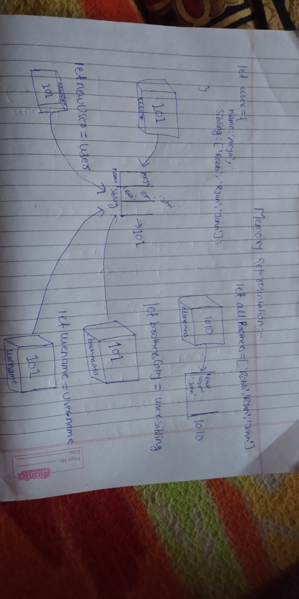

```js
let user = {
  name: 'Arya',
  sibling: ['Robb', 'Ryan', 'John'],
};
let allBrothers = ['Robb', 'Ryan', 'John'];
let brothersCopy = user.sibling;
let usename = user.name;
let newUser = user;
```

1. Memory representation

- Create the memory representation of the above snippet on notebook.
- Take a photo/screenshot and add it to the folder `code`

<!-- To add this image here use  -->


2. Answer the following with reason:

- `user == newUser;` // output and reason//true - here the copy by reference take place both value allocate the same address.
- `user === newUser;`//true - here the copy by reference take place both value allocate the same address.
- `user.name === newUser.name;`//true - here access the name  from the same address location beacuse here take the copy-by-reference 
- `user.name == newUser.name;`//true - here access the name  from the same address location beacuse here take the copy-by-reference 
- `user.sibling == newUser.sibling;`//true  - here access the sibling  from the same address location beacuse here take the copy-by-reference 
- `user.sibling === newUser.sibling;`//true -  here access the sibling  from the same address location beacuse here take the copy-by-reference 
- `user.sibling == allBrothers;`//false - here both are diffrent address so both are not equal 
- `user.sibling === allBrothers;`//false - here both are diffrent address so both are not equal 
- `brothersCopy === allBrothers;`//false - here both are diffrent address so both are not equal 
- `brothersCopy == allBrothers;`//false - here both are diffrent address so both are not equal 
- `brothersCopy == user.sibling;`//true - here the condition check with double equal to here declare and assign that value so that is equal.
- `brothersCopy === user.sibling;`//true - here the condition check with triple equal to here declare and assign that value so that is equal.
- `brothersCopy[0] === user.sibling[0];`//true - here the condition check with triple equal to  in that brotherCopy assign a value user.name then both value are same.
- `brothersCopy[1] === user.sibling[1];`//true - here the condition is check  triple equal to  in that brotherCopy assign a value user.name then both value are same.

- `user.sibling[1] === newUser.sibling[1];`//true - here the condition is check  triple equal to  both access the sibling both are eqaul because both has same address location . beacuse here use of copy-by-rference
